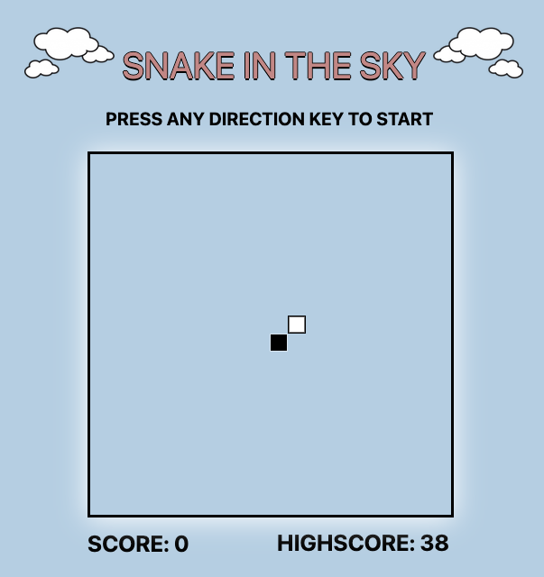

# SNAKE IN THE SKY

## Getting Started
[SNAKE IN THE SKY](https://pages.git.generalassemb.ly/msalamanca/Snake-Game/)
- Click link above to play!

### Instructions
- Use direction keys to steer the snake
- Hit as many clouds as possible while avoiding the border and your own body

## Technology
- Javascript
- HTML
- CSS
- Canvas

## Future Enhancements
- Make snake faster as snake grows longer
- Have snake go out through one side of the border and out the other
    - Only gameover when the snake hits its own body
